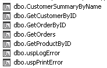

bd AdventureWorksLT2019

В решении 6 проектов: 
1. Models. new

   -Модели из БД.

2. FileManager

3. ConfigurationManager

4. DataAccess. new

   -Нижний уровень. Работа с базой данных. Заполнение моделей через единый репозиторий. Логгирование исключений в БД с ошибками.

5. ServiceLayer. new

   -Средний уровень. Бизнес логика. Подготовка модели для передачи выше.

6. DataManager. new

   -Веръний уровень. Создание XML. Транспортировка данных.

Хранимые процедуры в БД:

Пример процедуры получения покупателя по id:

Имеются БД и процедуры для хранения логов с такой таблицей:

